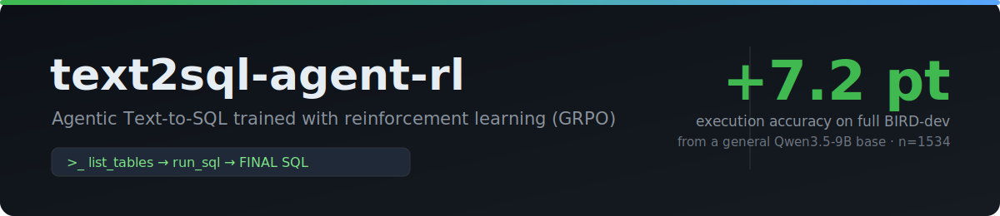
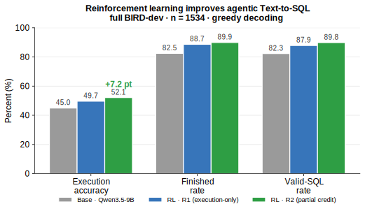
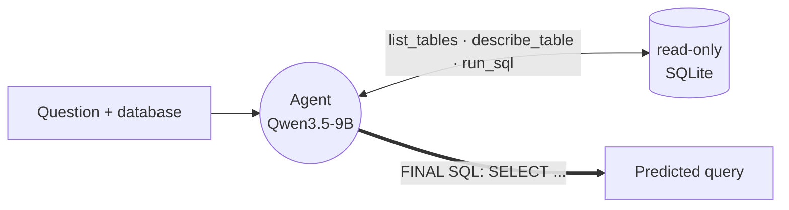
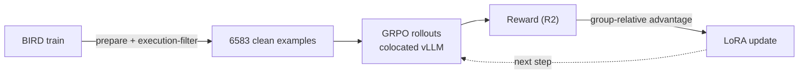

<div align="center">



&nbsp;

[](https://www.python.org/)
[](#results)
[](#tests)
[](#training)
[](#usage)

**Teach a general LLM to write correct SQL — by letting it explore the database and rewarding it for getting the answer right.**

</div>

---

A general-purpose **Qwen3.5-9B** — *not* a SQL-specialized model — is trained with reinforcement
learning (GRPO) to act as a **Text-to-SQL agent**: it inspects the schema with tools, runs trial
queries against a read-only SQLite copy, observes the results, and self-corrects before committing
a final query. RL alone lifts execution accuracy **+7.2 points** on the full BIRD dev set and makes
the agent noticeably more decisive.

## Results

<div align="center">

</div>

| Model | Execution Accuracy | Δ vs base | Finished |
|---|:--:|:--:|:--:|
| Qwen3.5-9B base | 0.4498 | — | 82% |
| + RL · R1 reward (execution-only) | 0.4967 | **+4.7 pt** · p≈0.009 | 89% |
| **+ RL · R2 reward (partial credit)** | **0.5215** | **+7.2 pt** · p<0.0001 | **90%** |

Execution Accuracy (EX) = BIRD official execution-match (result set-equality), greedy decoding,
evaluated on all 1534 dev questions. RL also raises the *finished*-rate — the share of questions
where the agent commits a final answer — from 82% to 90%.

> [!NOTE]
> Single training seed. The deltas are statistically significant at n=1534 (binomial z-test); a
> multi-seed confidence interval is the natural next step to fully nail the headline number.

## How it works

The model runs as an agent over read-only tools and ends each episode with a `FINAL SQL:` line.



| Tool | Purpose |
|---|---|
| `list_tables` | List tables in the database |
| `describe_table(table)` | Schema for a single table |
| `run_sql(query)` | Run a **SELECT** (read-only, timeout + row cap) and observe the result |

### Training

GRPO with LoRA adapters; rollouts are generated by a colocated vLLM engine, scored by a reward
function, and turned into a group-relative advantage that updates the adapter.



- **Base:** Qwen/Qwen3.5-9B · **Adapter:** LoRA r16 / α32 on MLP `{gate,up,down}_proj` + full-attention `{q,k,v,o}_proj`
- **Loop:** 150 steps, group size 4, lr 1e-5, KL 0 — fits a single 96 GB GPU
- **Data:** BIRD train, gold-execution-filtered (drop gold that errors or returns empty so GRPO groups aren't poisoned) — 6583 / 6601 kept

### Reward

The recommended reward is **R2** — faithful partial credit, fully deterministic, **no LLM judge**:

```
reward = 3·exec + 1·syntax + 1·schema + 1·ngram + 1·format
```

`exec` is execution-match vs gold (0/1); `syntax` checks the query runs; `schema` is the Jaccard of
{tables ∪ columns} vs gold; `ngram` is token-bigram Jaccard vs gold; `format` requires a valid
SELECT. Partial terms score 0 unless a valid SELECT is emitted, and `w_exec=3` keeps a correct
query strictly above any incorrect one. Partial credit gives a **denser gradient** than
execution-only and trains faster.

| Arm | Reward | Role |
|---|---|---|
| **`r2`** *(recommended)* | `3·exec + syntax + schema + ngram + format` | densest signal, best EX |
| `r1` | `exec ∈ {0,1}` | execution-only baseline |
| `s0` | `exec`, single-shot | ablation — no tool loop |
| `r3` | `0.2·describe + 0.3·executable + exec` | intentionally gameable foil |

## Project structure

```
src/sqlrl/          core (offline, CPU-testable)
  agent.py            agent loop (run_agent)
  tools.py            SqlToolset: list_tables / describe_table / run_sql
  db.py               read-only sqlite engine (write-guard, timeout, truncation)
  ex.py               BIRD execution-match
  reward.py           R1 / R2 / R3 reward functions
  prompts.py          single shared system prompt (eval + train use the same one)
  dataset.py          BIRD loader
  runner.py           eval runner + summarize
  train_env.py        TRL environment factory (tools as rollout actions)
  train_reward.py     TRL reward adapters
scripts/            entry points (data prep, train, serve, eval, compare)
configs/            yaml configs (train / eval / data)
tests/              51 offline tests
```

## Getting started

**Prerequisites:** Python 3.11+, the [BIRD dataset](https://bird-bench.github.io/), and — for
training/serving — a CUDA GPU (development used a single 96 GB card).

Core library + tests (offline, CPU only):

```bash
pip install -e ".[dev]"
```

> [!IMPORTANT]
> Evaluation also needs `openai` (it talks to the vLLM OpenAI-compatible server). Training also
> needs `torch`, `trl`, `peft`, and `vllm` — intentionally not pinned here; install versions
> matching your GPU/CUDA. See [`scripts/setup_gpu.sh`](scripts/setup_gpu.sh) for the exact setup used.

## Usage

```bash
# 1. prepare + execution-filter the BIRD training data
python scripts/prepare_data.py --config configs/data.yaml
python scripts/filter_data.py --in-json <prepared.jsonl> --db-root <train_databases> \
    --out-jsonl train_exec_filtered.jsonl

# 2. train (R2 reward)
python scripts/train_grpo.py --config configs/train.yaml --reward-arm r2 --run-name sqlrl-r2

# 3. serve a checkpoint with vLLM (base, or +LoRA adapter)
bash scripts/serve_vllm.sh base
bash scripts/serve_vllm.sh lora runs/sqlrl-r2/final

# 4. evaluate on full BIRD-dev and compare
python scripts/evaluate.py --config configs/eval.yaml --tag base
python scripts/evaluate.py --config configs/eval.yaml --tag r2 --model-name sqlrl-lora
python scripts/compare.py --baseline runs/eval_base.jsonl --tuned runs/eval_r2.jsonl
```

> [!TIP]
> Config paths point at the GPU-box layout used during development — edit them for your
> environment. Use `configs/eval_mini.yaml` for a fast 100-question sanity check instead of the
> full 1534-question run.

## Tests

```bash
pytest -q          # 51 offline tests, no GPU required
```

## Limitations

- Single training seed (n=1534 makes the deltas significant; a multi-seed CI would fully nail the headline).
- Config files are pinned to a specific GPU-box path layout — edit before running.
- Remaining eval losses are mostly context-overflow on long conversations; raising max_tokens / max_turns / context length is the obvious next lever.

## References

- **BIRD benchmark** — Li et al., *Can LLM Already Serve as a Database Interface?* ([arXiv:2305.03111](https://arxiv.org/abs/2305.03111))
- **R2 partial-reward shaping** adapted from *Reasoning-SQL* ([arXiv:2503.23157](https://arxiv.org/abs/2503.23157)), with the AI-feedback term omitted
- **Base model** — Qwen3.5-9B
